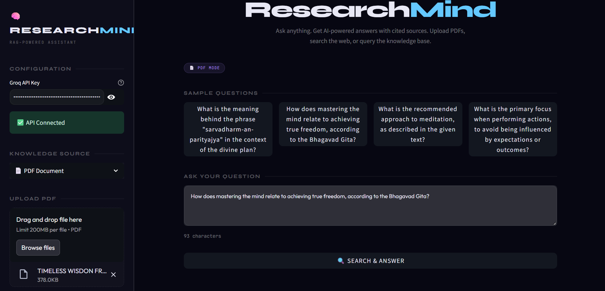
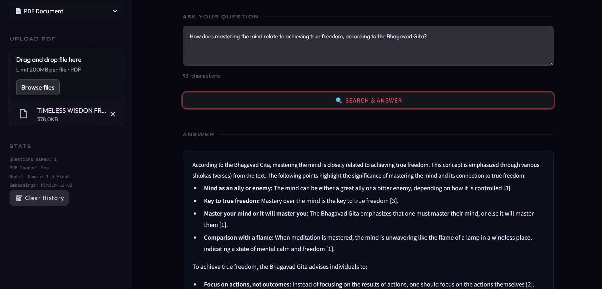
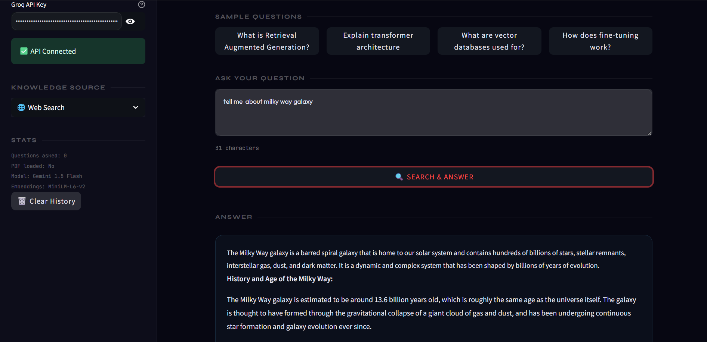
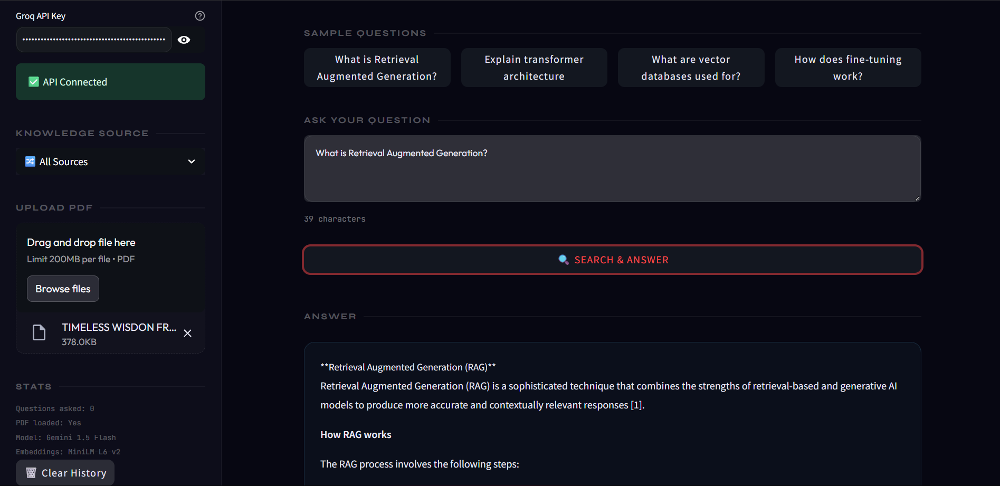

# 🧠 ResearchMind — RAG-Powered Research Assistant

> An intelligent research assistant using Retrieval Augmented Generation (RAG) that answers questions from PDFs, web search, and a built-in AI/ML knowledge base — powered by Groq LLaMA + ChromaDB + sentence-transformers.

[]()
[]()
[]()
[]()
[]()
[]()

---

## 🎯 What It Does

ResearchMind is a full end-to-end RAG pipeline that:

- **📄 PDF Mode** — Upload any research paper or document and ask questions about it
- **🌐 Web Mode** — Search the web in real-time and get AI-synthesized answers with sources
- **📚 KB Mode** — Query a built-in AI/ML knowledge base covering key concepts
- **🔀 All Sources** — Combine all three for the most comprehensive answers
- **📎 Cited Answers** — Every answer shows exactly which sources were used
- **✨ Smart Questions** — Auto-generates relevant sample questions from uploaded PDFs

---

## 🖥️ Screenshots

### PDF Mode — Auto-generated questions


### Answer with cited sources


### Web Search mode


### All Sources combined


---

## 🏗️ RAG Architecture

```
User Question
      │
      ▼
Query Embedding
(sentence-transformers/all-MiniLM-L6-v2)
      │
      ▼
Vector Similarity Search (ChromaDB)
      │
      ├── PDF chunks (PyMuPDF)
      ├── Web results (DuckDuckGo API)
      └── Knowledge base chunks
      │
      ▼
Top-K Relevant Chunks Retrieved
      │
      ▼
Prompt Construction
(Query + Context + Instructions)
      │
      ▼
Groq LLaMA 3.1 8B
(Answer Generation)
      │
      ▼
Cited Answer + Source Cards
```

---

## ⚙️ Tech Stack

| Component | Technology |
|---|---|
| LLM | Groq — LLaMA 3.1 8B Instant (free API) |
| Embeddings | sentence-transformers/all-MiniLM-L6-v2 |
| Vector Database | ChromaDB (in-memory) |
| PDF Processing | PyMuPDF (fitz) |
| Web Search | DuckDuckGo Search API (free, no key needed) |
| Frontend | Streamlit |
| Smart Questions | Auto-generated from PDF content using LLM |

---

## 🛠️ Run Locally

### 1. Clone the repository
```bash
git clone https://github.com/heyvishal08/researchmind.git
cd researchmind
```

### 2. Install dependencies
```bash
pip install -r requirements.txt
```

### 3. Get free Groq API key
- Go to **console.groq.com**
- Sign up with Google account (free)
- Click **API Keys → Create API Key**
- Copy the key (starts with `gsk_...`)

### 4. Run the app
```bash
python -m streamlit run app/streamlit_app.py
```

### 5. Use it
- Enter your Groq API key in the sidebar
- Choose knowledge source (PDF / Web / KB / All)
- Upload a PDF or type your question
- Click **Search & Answer**

---

## 🔬 How RAG Works

Traditional LLMs have a knowledge cutoff and can hallucinate. RAG fixes this by:

1. **Retrieval** — Finding relevant text chunks from real sources
2. **Augmentation** — Adding those chunks to the prompt as context
3. **Generation** — LLM generates answer grounded in real context

This means answers are accurate, up-to-date, and cited — not hallucinated.

---

## ✨ Key Features

**Smart PDF Questions**
When you upload a PDF, the app automatically generates 4 relevant questions based on the document content. No need to think about what to ask — the app suggests the most relevant questions.

**Multi-Source RAG**
Unlike most RAG demos that use a single source, ResearchMind combines PDF, web search, and a knowledge base simultaneously for comprehensive answers.

**Cited Answers**
Every answer includes source cards showing exactly which text chunks were used, with source attribution. Full transparency on where the information came from.

---

## 📈 Key Learnings

- RAG significantly reduces LLM hallucinations by grounding answers in real retrieved context
- Chunk size (100 words) and overlap (20 words) critically affect retrieval quality
- Semantic search via embeddings outperforms keyword search for research queries
- Combining multiple sources gives more comprehensive and reliable answers
- Auto-generating questions from document content dramatically improves UX

---

## ⚠️ Limitations

- Web search depends on DuckDuckGo availability
- Groq free tier: 14,400 requests/day, very generous
- Large PDFs (100+ pages) may take 1-2 minutes to process
- ChromaDB runs in-memory — data resets on app restart
- Future improvement: persistent vector storage with Pinecone

---

## 🗺️ Portfolio Roadmap

| # | Project | Status |
|---|---|---|
| 1 | TruthLens — Fake News Detector | ✅ Complete |
| 2 | **ResearchMind — RAG Assistant** | ✅ Complete |
| 3 | Stock Sentiment + Price Prediction | 🔲 Next |
| 4 | Smart Traffic Analysis | 🔲 Planned |
| 5 | Research Paper Replication | 🔲 Planned |

---

## 📬 Contact

**Vishal** · BCA Graduate · MSc AI Engineering Applicant
🔗 [GitHub](https://github.com/heyvishal08)
🤗 [TruthLens Demo](https://huggingface.co/spaces/ReizenO8/truthlens)

---

## 📄 License

MIT License — free to use, modify, and distribute.

---

*Portfolio Project #2 of 5 · MSc AI Engineering Application Portfolio*
